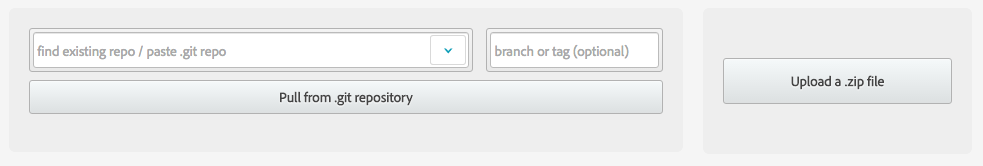
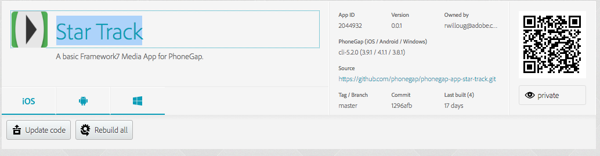

To start we'll create an extremely basic Hello World app from scratch. Start by creating a directory to hold your PhoneGap Build app. A very basic PhoneGap app can consist of 2 files:

1. A `config.xml` file:
        
        <widget xmlns="http://www.w3.org/ns/widgets" 
                xmlns:gap="http://phonegap.com/ns/1.0"
                xmlns:android="http://schemas.android.com/apk/res/android" 
                id="com.phonegap.build.demo" version="0.0.1">

	      <name>PhoneGapBuild</name>
	      <description>It's just a demo.</description>
	      <author>PhoneGap Team</author>

          <!-- PGB -->
	      <preference name="phonegap-version" value="cli-6.1.0" />

        </widget>

2. An `index.html` file:

        <!DOCTYPE html>
        <html>
   	      <head>
    	    <meta name="viewport" content="width=device-width, initial-scale=1.0, user-scalable=0" />
            <script src="cordova.js"></script>
    	  </head>
    	  <body>
    	    <p><h1>Can I have beer yet<h1></p>
    	  </body>
        </html>

Alternatively you can find this app in `extras/app/module-1`.

Zip up the contents of the app directory, and upload it to [PhoneGap Build](https://build.phonegap.com).



Once your builds complete, scan with your QR code and install.

----

Lets build PhoneGap's Star Track using PhoneGap Build:

    phonegap create StarTrack --template https://github.com/phonegap/phonegap-app-star-track.git
    cd StarTrack
    phonegap remote login
    phonegap remote build android

If you're not a CLI user, you can just enter the above git url on build.

Navigate to PhoneGap Build and find your app:



----

### PhoneGap CLI

If you're a command-line user, you can use the Phonegap CLI to create an app and push it to Build, as we did at the start with Star Track.

Install phonegap:

```
npm install phonegap
phonegap remote --help
```

Create the application, login to PGB and run the remote build:

```
phonegap create path/to/pg-cli-app "com.phonegap.cli.demo" "PhonegapCLIApp"
cd path/to/pg-cli-app
phonegap login
phonegap remote build android

# the android-sdk is required to run from command line, otherwise use a QR code
phonegap remote run android
```

----

### REST API

The PhoneGap CLI uses PGB's REST API to interact with Build. You can use this API yourself to write your own build scripts, or write third-party applications that integrate with PhoneGap Build.

**API Examples (using `curl` for simplicity):**

- Get your API token you can also generate and retrieve it from ([your account settings](https://build.phonegap.com/people/edit)):

        curl -u rwilloug@adobe.com https://build.phonegap.com/api/v1/token

- Get your profile:

		curl https://build.phonegap.com/api/v1/me?auth_token=1234567890

- Create an app:

		curl -F file=@/Users/ryanw/dev/testapp.zip -F 'data={ "title":"whatever", "create_method":"file"}' https://build.phonegap.com/api/v1/apps?auth_token=1234567890


The API will be discussed more later in the workshop. [Full API Documentation can be found here.](http://docs.build.phonegap.com/en_US/developer_api_api.md.html#PhoneGap%20Build%20Developer%20API)


<div class="row" style="margin-top:40px;">
<div class="col-sm-12">
<a href="2-setting-up-your-ios-developer-key.html" class="btn btn-default pull-right">Next <i class="glyphicon
glyphicon-chevron-right"></i></a>
</div>
</div>
