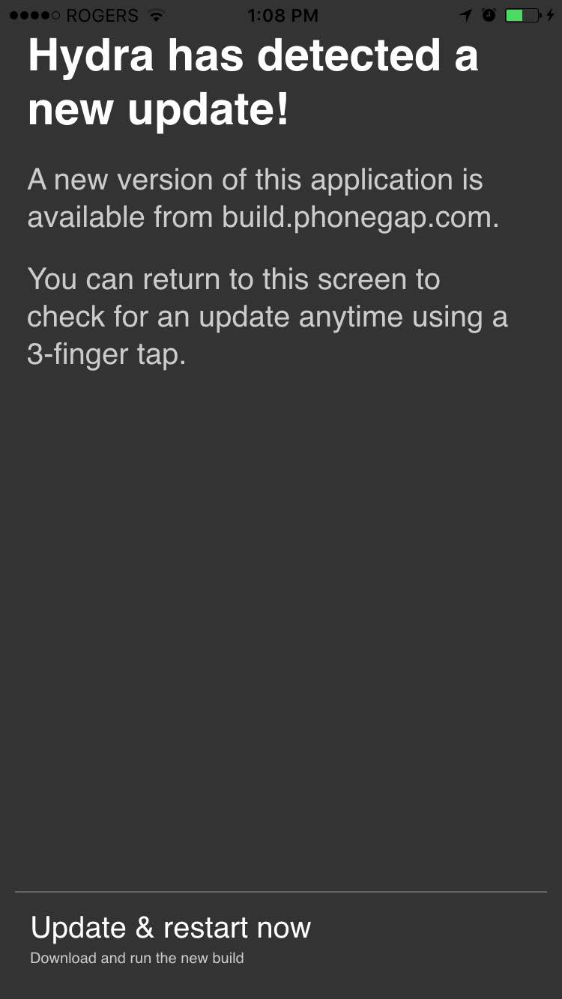
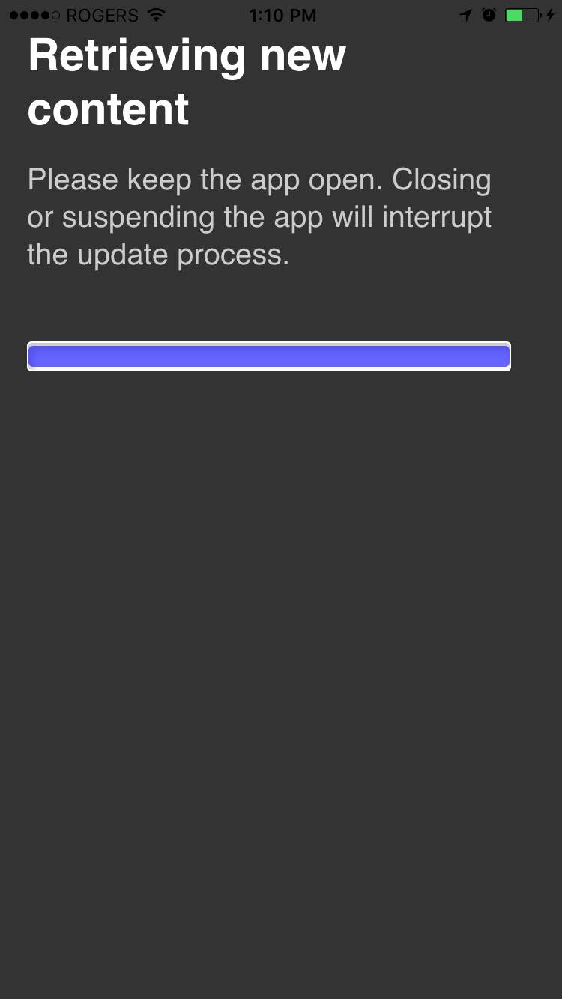
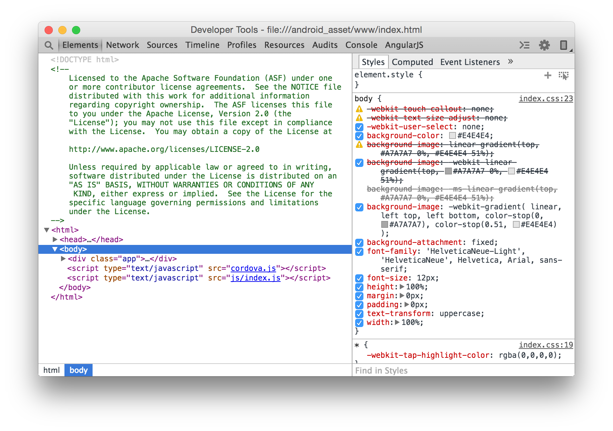

PhoneGap Build eliminates (mostly) the need for SDK's and IDE's. Without these tools however, we need to know how to debug our app.

-----

#### Edit

Any text editor (Sublime Text?)

-----

#### Deploy

iOS and Android builds can initially be deployed by scanning a QR code.

PhoneGap Build also offers a tool called **Hydration** which allows you to quickly upload and deploy changes to your PhoneGap app's web assets (HTML, JS, CSS) without doing a full re-build and re-install. 

Select an app on [Build](https://build.phonegap.com/apps), open the app details tab, check the `Hydrates` checkbox and click Save. Re-install upon completion.

Note that Hydration is only capable of pushing updates to your web assets. Any changes to your config.xml, such as adding plugins, will require a full re-build and re-install.

-----

#### Debug

The PhoneGap webview can be debugged using standard browser developer tools. Other workshops will have likely touched on this, but here's an overview:

##### Android

**OSX & Windows**: Chrome Remote Developer Tools
Connect your Android device to your computer, and navigate to chrome://inspect in Chrome browser.

##### iOS

- **OSX**: Safari JavasScript Developer Tools
Enable the Develop Menu in Safari Advanced Settings. Connect your iOS Device and the PG Webview should appear in the develop menu.
- **Windows**: Weinre (see below)

##### Windows Phone

- **OSX & Windows**: Weinre

##### Example

Here's an example to demo both Hydration, and debugging:

Add a new button which vibrates your phone:

    <a href="#" id="vibrate">VIBRATE</a>

    cordova.plugins.notification.vibrate();

Update your app using `phonegap remote build ios` or the web UI.

Synchronize your hydrated app with a 3-finger tap, or by restarting the application.

Click the vibrate button, and nothing will happen.

Launch the Chrome Developer Tools, and try clicking again. We see that the app is missing the notification plugin in the `config.xml`. Let's add it straight from the Github repository (for demo purposes -- npm is a better option).

    <plugin spec="http://github.com/apache/cordova-plugin-vibration.git#2.1.1" />

----

#### Weinre

Weinre is a remote implementation of the Webkit developer tools. You can include it automatically in your PhoneGap Build application by checking the `debug` option on your app, or setting it to true via the API. Its not the most stable of tools -- but is an option when the Chrome and Safari Developer tools are not an option.

#### Native Issues

Some issues won't be debuggable through the web tools. Native SDK's are the next steps when this occurs:

- Android: install the android sdk, and run `adb logcat` with and Android device connected
- iOS: some third party standalone applications allow you to watch the iOS device console
- Windows: go to the pub

<a href="5-generating-keys-and-publishing-your-app.html" class="btn btn-default pull-right">Next <i class="glyphicon
glyphicon-chevron-right"></i></a>

