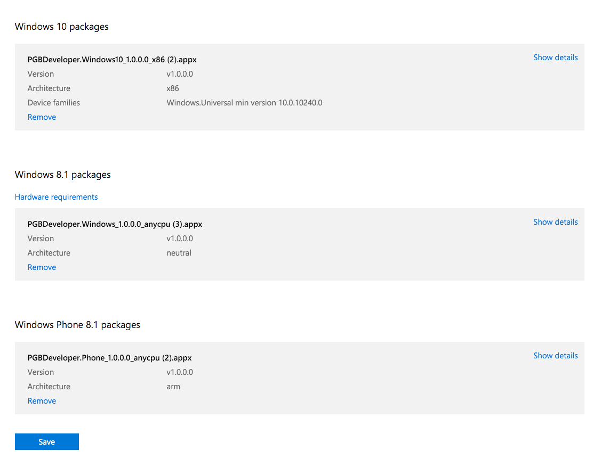

## cordova-windows on PhoneGap Build

1. Set your `phonegap-version` to `cli-6.1.0`:

    <preference name="phonegap-version" value="cli-6.1.0" />

2. You'll first need to create a pfx certificate file. When creating your certificate, you must enter a Publisher matching Windows Dev Center -> Account Settings -> Windows Publisher ID. Run [helper script windows-cert.bat](./windows-cert.bat) in a Powershell window.

3. The `author` field in your config.xml must match the Publisher Display Name from Windows Dev Center -> Account Settings:
    
    <author>Adobe Systems Canada Inc</author>

4. The `windows-identity-name` preference in your config.xml must match the App Identity Name from Windows Dev Center -> App Management -> App Identity:

    <preference name="windows-identity-name" value="PhonegapBuild.PGBDeveloper" />

Your required Publishing IDs can be found in Windows Dev Center -> App Management -> App Identity. Any errors will be reported when uploading your appx file to the Windows Dev center.

### Windows (8.1)

Set your `appx_target` to `8.1-win`:

    <preference name="windows-appx-target" value="8.1-win" />

### Windows Phone (8.1)

Set your `appx_target` to `8.1-phone`:

    <preference name="windows-appx-target" value="8.1-phone" />

### Windows 10 (Universal)

Set your `appx_target` to `uap`:

    <preference name="windows-appx-target" value="uap" />

Also note that the default architecture is `anycpu`. For uap, must be one of `x86`, `x64`, or `arm`:

    <preference name="windows-arch" value="x86" />

### Here's the resulting packages after uploading to the Windows Dev Center:

